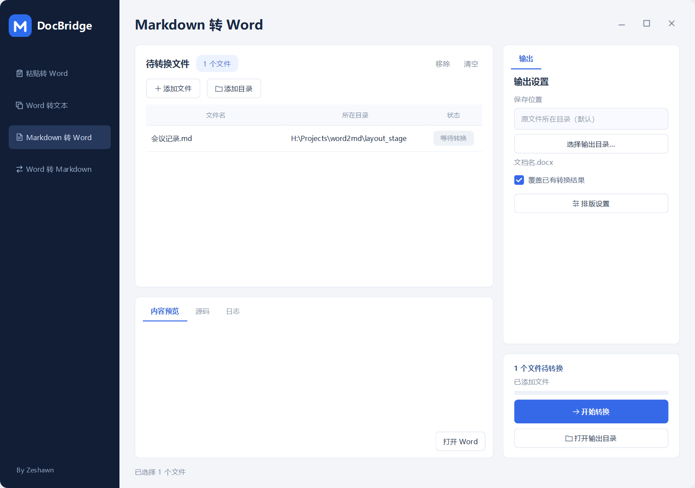
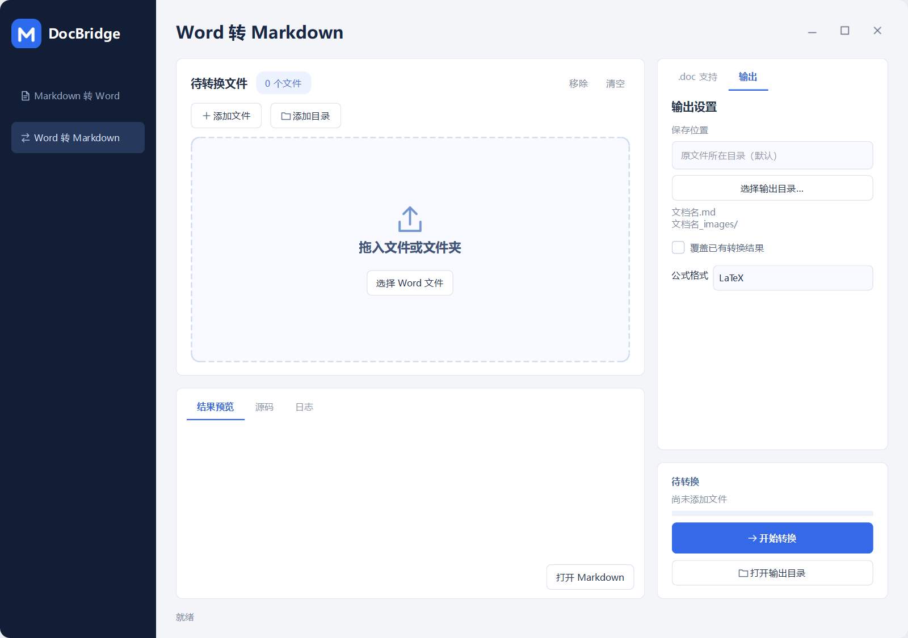
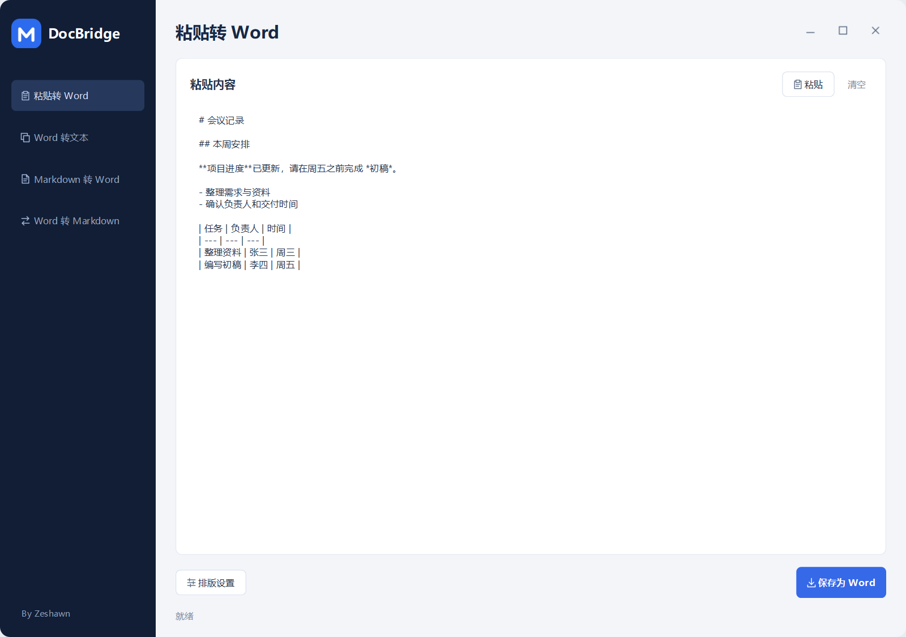
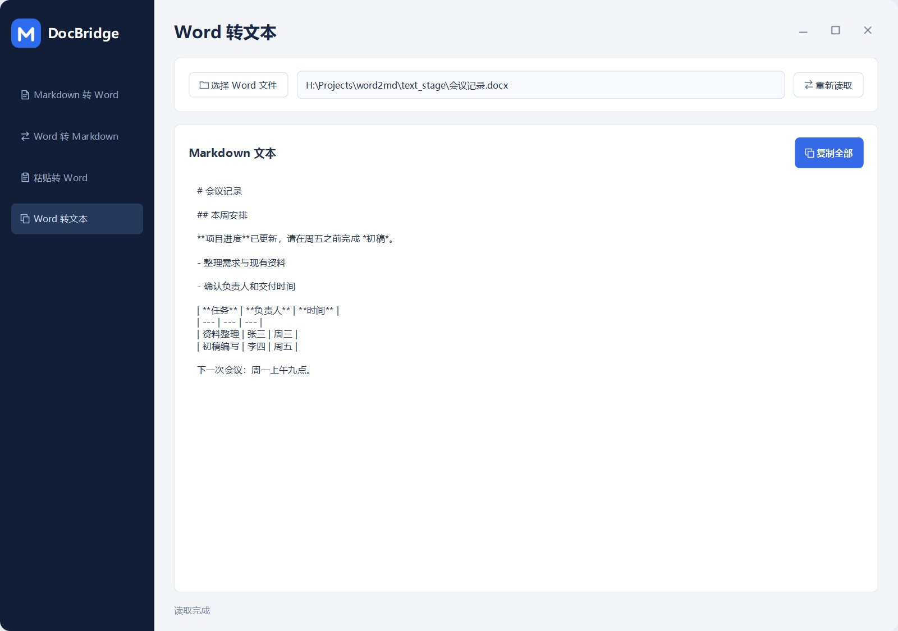
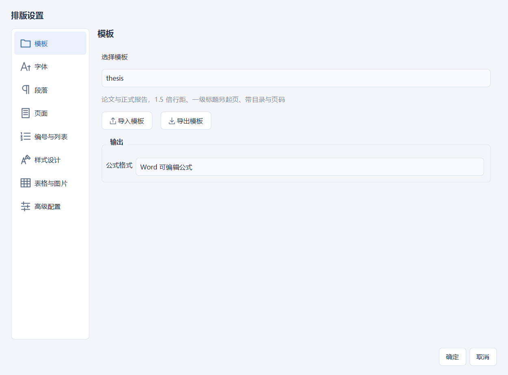
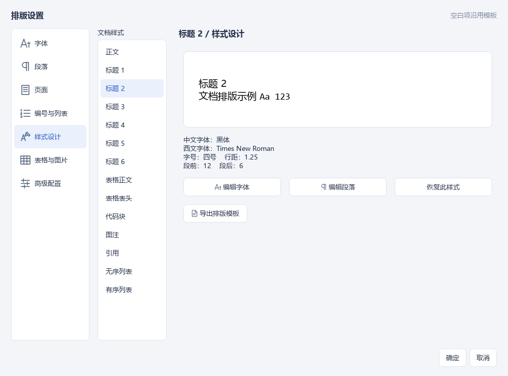
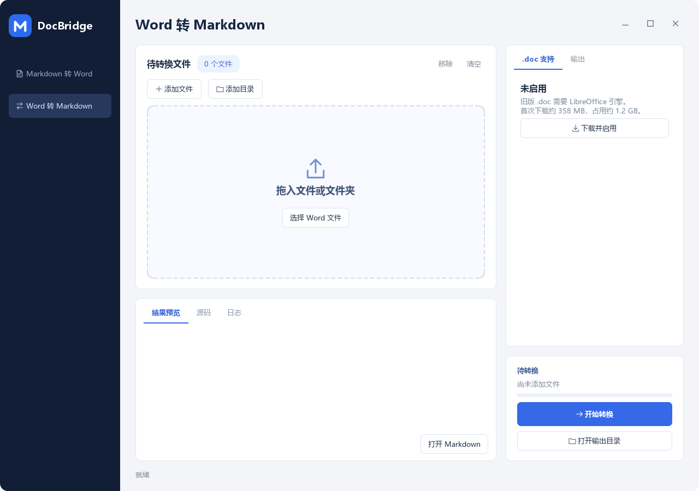

# DocBridge

Word 与 Markdown 双向转换工具，提供 Windows 图形界面和命令行。

## 功能

- Markdown 转 Word：模板排版、正文及标题 1–6 级样式、页码、编号、列表、表格和图片。
- Word 转 Markdown：按原标题层级导出，保留粗体、斜体、列表、链接和表格；图片导出并重映射相对路径。
- 粘贴转 Word：直接粘贴 AI 输出或 Markdown 文本，使用默认排版保存为 Word；需要时再打开排版设置。
- Word 转文本：选择或拖入一份 Word 文档，直接显示 Markdown 文本，一键复制，不生成 MD 文件。
- 自动目录按正文标题重建为可点击目录；合并单元格表格使用 HTML 保留结构。
- 公式双向转换：Markdown 公式可生成可编辑 Word 公式或 PNG；Word 原生公式可导出 LaTeX 或 PNG。
- 批量添加、目录导入、拖放、预览与日志。两个方向的队列、结果及任务状态相互独立。
- 圆角无边框窗口，左侧保留 M 图标与功能入口；窗口按钮位于右上角，没有独立标题栏，支持拖动与缩放。
- 文本功能位于导航前两项；左下角显示 By Zeshawn。
- 旧版 `.doc` 使用可选 LibreOffice 引擎，默认不包含、不下载，也不启动引擎。





## 启动

便携版运行 `docbridge.exe`。从源码运行需要 Python 3.10 或更高版本：

```powershell
python -m venv .venv
.venv\Scripts\python.exe -m pip install -r requirements.txt
.venv\Scripts\python.exe md2docx_gui.py
```

Windows 下也可双击 `run-gui.bat`，使用项目内的虚拟环境。
原来的 `md2docx.py`、`docx2md.py` 和 `md2docx_gui.py` 入口继续可用。

## 文本转换

“粘贴转 Word”直接粘贴内容后点击“保存为 Word”，选择保存位置。默认保留标题、列表、
表格、加粗与斜体，公式生成可编辑的 Word 公式。排版设置可调整字体、段落、页面及逐级标题样式，
不需要设置即可转换。支持 AI 输出外层的 `markdown` 或 `md` 代码围栏。

“Word 转文本”选择文件后自动读取，点击“复制全部”即可粘贴到其他应用。两个文本页面只处理
文字：输入图片保留描述，Word 图片略过，Mermaid 保留代码，不导出图片或其他附加文件。
Word 原生公式及 DocBridge 公式图片尽可能恢复为 LaTeX；无法恢复的公式保留文字并提示。





CLI 使用同一个文本转换接口，支持直接文本、标准输入和标准输出：

```powershell
md2docx.exe --text "# 标题" -o 报告.docx
Get-Content 内容.txt -Raw -Encoding utf8 | md2docx.exe --stdin -o 报告.docx
docx2md.exe 报告.docx --stdout
```

也可用 `md2docx.exe - -o 报告.docx` 读取标准输入。文本写入支持原有 `-c`、`--set` 排版选项；
输出重名时默认报错，使用 `--overwrite` 才替换已有文件。`--stdout` 每次读取一份文档，
正文写到标准输出，提示写到标准错误，不混入正文。需要文件及图片导出时使用原有转换模式。

## 文件输出

文件转换页默认保存到每份原文件所在目录。重名时添加编号，勾选覆盖后才替换结果。
Word 转 Markdown 的输出名称保持一致：

```text
报告.docx
报告.md
报告_images/
    报告_001_图片摘要.png
```

Markdown 图片路径支持中文、空格及 URL 编码。转换保留内容和结构，页面版式无法逐字节还原；
Markdown 转 Word 暂不解析 HTML 合并表格。手工输入、没有目录样式的目录按原文保留。

## 排版

“粘贴转 Word”和“Markdown 转 Word”共用“排版设置”弹窗，各自保存自己的设置。
“模板”分类支持选择、导入和导出 YAML 模板。切换模板会载入该模板的实际设置，并清除之前的局部修改；
取消弹窗则保持原设置。字号、行距等直接显示当前值，复选框为勾选和未勾选两种状态。
查看设置不会产生额外覆盖，手动修改后才保存变更。字体、段落、页面、编号与列表、样式设计、
表格与图片分类保留，正文和标题 1–6 级可分别调整。
不再自动生成 Word 目录，旧模板中的目录生成选项也会忽略。编号剥离只处理参与自动编号的标题，
正文和参考文献中的方括号标记保持原样。标题样式及自动编号使用各层级配置的字体和颜色。
Word 导出的加粗文本遇到标点边界时使用内联 `<strong>` 标签，避免星号边界无法解析；
粘贴和文件转换均支持这些格式标签及中文标点旁的加粗标记。





`config/` 提供通用、论文、公文和紧凑模板。便携程序旁的同名模板可覆盖内置模板。
Mermaid 图使用系统 Chrome 或 Edge 本地渲染；缺少渲染工具时会保留源码。

## 公式

Word 输出的“公式格式”位于排版弹窗的“模板”分类，控件显示当前模板或修改后的实际选择。内置模板使用
可编辑的 Word 原生公式（OMML）；也可选 PNG 图片或保留 LaTeX 源码。Word 转 Markdown
在“输出”页默认选择 LaTeX，也可选 PNG；图片保存到 `文档名_images/`，链接使用相对路径。

支持 `$...$`、`$$...$$`、`\(...\)`、`\[...\]`，包括分式、根号、上下标、求和、积分、
矩阵和常见重音符号。代码块和行内代码不解析为公式。独立公式居中，行内公式保留在原段落中；
GUI 预览会显示公式，源码页仍保留 Markdown。图片和预览统一使用 KaTeX 0.18.10，
通过本机 Edge 或 Chrome 的无头模式以 288 dpi 渲染。脚本、CSS 和字体随程序打包，
运行时不访问 CDN，也不需要 TeX、Node.js 或 Office。可用 `DOCBRIDGE_BROWSER` 指定浏览器路径。

```markdown
行内公式 $x_1^2$。

$$
\frac{a}{b} + \sqrt{x}
$$
```

未知 LaTeX 命令或渲染失败时保留源码并报告提示。不能转换的 Word 公式保留原始 OMML XML
到同名资源目录并提供链接。Word 导出图片失败时退回 LaTeX。DocBridge 生成的公式 PNG
保留了源码，之后可重新导出为 LaTeX；普通公式截图不执行 OCR，仍按图片处理。
图片模式支持 KaTeX 的颜色、方框、中文文字和单个表达式内的宏；每个公式单独解析，
不共享宏定义。可编辑 Word 公式仍使用独立的 LaTeX 转 OMML 后端，支持范围与 KaTeX 不完全相同。
缺少浏览器或 KaTeX 不支持输入时保留源码并提示；不会自动下载浏览器。

## 可选的 .doc 支持

在 Word 转 Markdown 的“.doc 支持”页点击“下载并启用”，才会下载官方 LibreOffice 引擎。
首次下载约 358 MB，准备后约 1.2 GB；支持下载进度、取消、SHA-256 校验和失败重试。
文件准备期间取消会等待当前操作结束，不进行系统安装。`.docx` 无需引擎。



为兼容之前的版本，引擎缓存仍保存在 `%LOCALAPPDATA%/md2stdreport/runtime/libreoffice/`。
可通过 `DOCX2MD_RUNTIME_DIR` 指定缓存位置，或通过 `DOCX2MD_LIBREOFFICE` 指定可执行程序。
已有系统 LibreOffice 也可使用。启动、切换功能及缺少引擎时的转换不会触发下载。

## 命令行

完整操作和参数示例见 [命令行使用说明](README_CLI.md)。

```powershell
# Markdown 转 Word
.venv\Scripts\python.exe md2docx.py 报告.md
.venv\Scripts\python.exe md2docx.py 报告.md -c config\thesis.yaml
.venv\Scripts\python.exe md2docx.py 报告.md --math-mode image

# Word 转 Markdown，默认输出到原目录
.venv\Scripts\python.exe docx2md.py 报告.docx
.venv\Scripts\python.exe docx2md.py 文档目录 -r -o 输出目录
.venv\Scripts\python.exe docx2md.py 报告.docx --math-mode image

# 用户主动下载并启用 .doc 引擎
.venv\Scripts\python.exe docx2md.py --download-engine
```

便携包提供 `md2docx.exe` 和 `docx2md.exe`，参数与对应 Python 入口相同。
各命令可用 `--help` 查看完整参数。

## 构建

```powershell
.venv\Scripts\python.exe -m pip install -r packaging\requirements-build.txt
.venv\Scripts\python.exe packaging\build.py
```

构建生成 `docbridge.exe`、两个命令行程序和 `docbridge-<版本>-win64.zip`，
并检查命令行双向转换及界面启动。验证产物写入临时目录，不依赖本地测试文件。
默认发布包不包含 LibreOffice 引擎。

GitHub Actions 在 `main` 提交后自动构建并验证，成功后创建版本标签和公开 Release，附带 GUI、两个命令行程序、便携 ZIP 及 SHA-256 校验清单。首次使用源码基线版本，之后自动递增补丁号（如 `v1.1.0`、`v1.1.1`）；手动提高源码版本可开始新的大版本或小版本。重跑同一提交复用版本，不重复创建标签；PR 只构建、不发布。发布标签中的源码版本与 EXE、ZIP 保持一致，版本提交不回写主分支。构建或验证失败时不发布；附件上传完毕后才公开 Release。
源码仓库排除虚拟环境、构建包、个人文档、引擎、临时文件及本地测试文件。

模块职责和扩展方式见 [架构说明](docs/architecture.md)。
